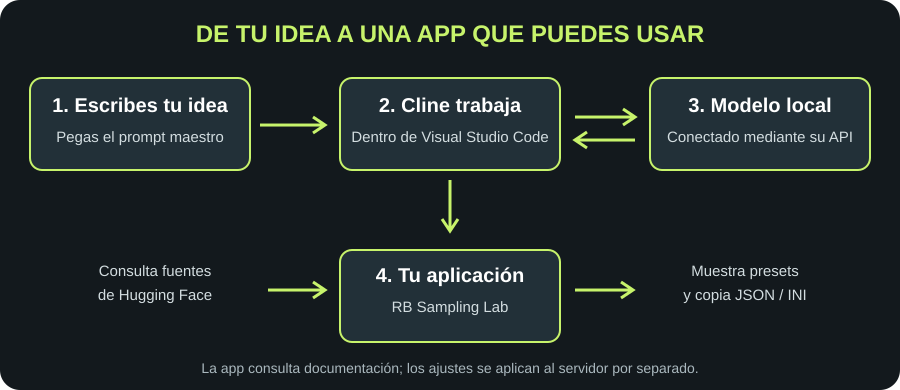

# VScode-Cline

## De un modelo local a una aplicación real, paso a paso

Conecta **Visual Studio Code + Cline + tu modelo local** y construye **RB Sampling Lab**: una aplicación que consulta recomendaciones de sampling publicadas en Hugging Face y permite copiarlas en JSON o INI.

> 🎯 **La meta:** que puedas repetir el proceso aunque nunca hayas usado Cline. Primero conectamos, después construimos y al final comprobamos el resultado.



```text
Tú escribes lo que necesitas
           ↓
Visual Studio Code + Cline
           ↓
API de tu servidor local → modelo cargado
           ↓
Cline crea y revisa archivos en tu carpeta
           ↓
RB Sampling Lab → buscar → comparar presets → copiar
```

**Esta guía parte de un servidor local ya instalado y funcionando.** No incluye descargar modelos ni configurar la GPU. Usaremos Windows para los ejemplos; la conexión es equivalente en otros sistemas.

**Sobre el material:** la referencia recuperada de la conversación conserva la demostración y el cierre, pero no el prompt maestro original ni todo el historial de instalación. El prompt incluido es una **reconstrucción documentada**, no una transcripción. Este repositorio contiene documentación y ejemplos; la app se construye siguiendo el tutorial.

## Índice

- [1. Qué vas a conseguir](#1-qué-vas-a-conseguir)
- [2. Qué necesitas antes de empezar](#2-qué-necesitas-antes-de-empezar)
- [3. Instalar y abrir Visual Studio Code](#3-instalar-y-abrir-visual-studio-code)
- [4. Crear y abrir la carpeta del proyecto](#4-crear-y-abrir-la-carpeta-del-proyecto)
- [5. Instalar Cline](#5-instalar-cline)
- [6. Preparar los datos del servidor local](#6-preparar-los-datos-del-servidor-local)
- [7. Conectar Cline a la API local](#7-conectar-cline-a-la-api-local)
- [8. Comprobar la conexión y la carpeta](#8-comprobar-la-conexión-y-la-carpeta)
- [9. Pegar el prompt maestro](#9-pegar-el-prompt-maestro)
- [10. Abrir y entender RB Sampling Lab](#10-abrir-y-entender-rb-sampling-lab)
- [11. Buscar el modelo de la demostración](#11-buscar-el-modelo-de-la-demostración)
- [12. Comprobar los tres presets oficiales](#12-comprobar-los-tres-presets-oficiales)
- [13. Copiar JSON e INI](#13-copiar-json-e-ini)
- [14. Usar la app en la web del autor](#14-usar-la-app-en-la-web-del-autor)
- [15. Si algo falla](#15-si-algo-falla)
- [16. Estructura del repositorio](#16-estructura-del-repositorio)
- [17. Comandos útiles](#17-comandos-útiles)
- [18. Preguntas frecuentes](#18-preguntas-frecuentes)
- [19. Créditos y recursos](#19-créditos-y-recursos)

## 1. Qué vas a conseguir

Al terminar tendrás Cline conectado a tu servidor y una app creada dentro de una carpeta de tu ordenador.

En la app podrás introducir un identificador como `Qwen/Qwen3.6-35B-A3B`, consultar las configuraciones publicadas por el autor del modelo y copiar los parámetros de cada preset.

**Sampling** es el conjunto de ajustes que influyen en cómo el modelo elige su siguiente respuesta. Un **preset** reúne varios ajustes para un uso concreto. No necesitas memorizar sus nombres para seguir el tutorial.

> ✅ **Resultado final esperado:** buscar un modelo, ver la fuente de sus recomendaciones y copiar una configuración sin tener que transcribirla a mano.

## 2. Qué necesitas antes de empezar

- Un ordenador con Visual Studio Code o permiso para instalarlo.
- Un servidor local que ya responda mediante una API compatible con OpenAI.
- Un modelo cargado, adecuado para programación y para trabajar con herramientas de un agente.
- La dirección del servidor, su clave si usa autenticación y el identificador del modelo que acepta.
- Conexión a Internet para instalar la extensión y consultar Hugging Face desde la app.
- Una carpeta nueva para el ejercicio.

**No hay una cifra universal de RAM o VRAM.** Depende del modelo, su formato y la configuración que ya utilices en tu servidor. El nombre `35B-A3B` no significa que baste con memoria para un modelo de 3B.

No necesitas una cuenta de pago de OpenAI para conectar Cline a tu propia API local. Que una API sea compatible con OpenAI describe su forma de comunicación; no significa que envíe las peticiones a OpenAI.

## 3. Instalar y abrir Visual Studio Code

1. Entra en la [página oficial de instalación de VS Code para Windows](https://code.visualstudio.com/docs/setup/windows).
2. Descarga el instalador que corresponda a tu equipo y ejecútalo.
3. Sigue los pasos del instalador. La opción de añadir VS Code a `PATH` permite abrirlo desde una terminal, pero no hace falta para este tutorial.
4. Abre **Visual Studio Code** desde el menú Inicio.

> 👀 **Qué debes ver:** la ventana del editor, con una barra de iconos a la izquierda. No lo confundas con Visual Studio: son programas distintos.

**📷 Captura sugerida: VS Code abierto**

Archivo recomendado: `assets/01-vscode-abierto.png`. Muestra la ventana inicial y señala el Explorador de archivos. Consulta la [lista completa de capturas](assets/README.md).


## 4. Crear y abrir la carpeta del proyecto

1. Abre el Explorador de archivos de Windows.
2. En Documentos, crea una carpeta llamada **RB-Sampling-Lab**.
3. Vuelve a VS Code y pulsa **Archivo → Abrir carpeta…** / **File → Open Folder…**.
4. Selecciona `RB-Sampling-Lab` y pulsa **Seleccionar carpeta**.
5. Si VS Code pregunta por la confianza, confirma únicamente si es la carpeta que acabas de crear.

> ✅ **Comprueba:** en el Explorador de VS Code aparece `RB-Sampling-Lab`. Puede estar vacía; es normal.

**Dos nombres, dos cosas:** `VScode-Cline` es este repositorio de documentación. `RB-Sampling-Lab` es la carpeta donde Cline construirá la app. Usar una carpeta aparte evita mezclar el ejercicio con esta guía.

**📷 Captura sugerida: carpeta abierta**

Archivo: `assets/02-carpeta-proyecto.png`. Debe verse el nombre de la carpeta en el Explorador de VS Code.


## 5. Instalar Cline

1. Pulsa el icono **Extensiones** de la barra izquierda. En Windows también puedes usar `Ctrl + Shift + X`.
2. Busca **Cline**.
3. Comprueba que es la extensión de la [ficha oficial del Marketplace](https://marketplace.visualstudio.com/items?itemName=saoudrizwan.claude-dev), con identificador `saoudrizwan.claude-dev`.
4. Pulsa **Instalar** y espera a que termine.
5. Abre el panel de Cline desde su icono. Si VS Code pide recargar la ventana, hazlo.

**Cline** es la extensión que recibe tus instrucciones y puede leer, crear o modificar archivos y ejecutar comandos mediante sus herramientas. El modelo aporta las respuestas; Cline conecta esas respuestas con el proyecto.

> 👀 Los nombres y la posición de algunos controles pueden cambiar entre versiones. Lo importante es encontrar la configuración del proveedor y sus campos de conexión.

**📷 Captura sugerida: extensión correcta**

Archivo: `assets/03-cline-extension.png`. Muestra el nombre, el identificador y el botón de instalación.


## 6. Preparar los datos del servidor local

Abre el programa con el que ya ejecutas tu modelo. Comprueba que **el servidor está encendido y el modelo está disponible**. Tener una ventana de chat abierta no garantiza que su API esté activada.

Puedes usar estas alternativas; sigue la documentación de la que ya tengas:

| Servidor | Ejemplo de Base URL | Guía oficial |
| --- | --- | --- |
| llama.cpp | `http://localhost:8080/v1`, si tu servidor escucha en 8080 | [Servidor llama.cpp](https://github.com/ggml-org/llama.cpp/blob/master/tools/server/README.md) |
| Ollama | `http://localhost:11434/v1` | [Compatibilidad de Ollama](https://docs.ollama.com/api/openai-compatibility) |
| LM Studio | `http://localhost:1234/v1`, si utiliza 1234 | [Compatibilidad de LM Studio](https://lmstudio.ai/docs/developer/openai-compat) |
| Otro servidor compatible | La dirección que muestre su configuración | Consulta su documentación |

**Son ejemplos, no una detección de tu equipo.** Si has cambiado el puerto, utiliza el tuyo. `localhost` significa que el servidor está en el mismo ordenador que el cliente; si VS Code trabaja dentro de otro entorno, esa dirección puede no apuntar a tu equipo habitual.

Anota estos tres datos:

```text
Base URL: dirección de mi API, normalmente terminada en /v1
API Key: clave real, o valor de relleno si el servidor no exige clave
Model ID: identificador exacto que acepta mi servidor
```

**El Model ID puede ser un alias.** En llama.cpp, por ejemplo, `--alias` permite definir el nombre expuesto por la API. Copia el identificador que muestra tu servidor o el campo `id` de `/v1/models`; no deduzcas el nombre a partir del archivo descargado.

## 7. Conectar Cline a la API local

1. Abre la configuración de Cline, normalmente mediante el engranaje ⚙️.
2. En **API Provider**, elige **OpenAI Compatible**.
3. En **Base URL**, pega la dirección de tu API.
4. En **API Key**, escribe la clave real si tu servidor la exige. Si no exige autenticación y el formulario requiere un valor, utiliza uno de relleno como `local`. En Ollama, la documentación utiliza `ollama` y señala que se ignora.
5. En **Model ID** o **Model**, escribe el identificador exacto aceptado por tu servidor.
6. Guarda los cambios o utiliza el control de verificación si tu versión lo ofrece.

La disposición de estos campos está descrita en la [guía oficial de Cline para OpenAI Compatible](https://docs.cline.bot/provider-config/openai-compatible).

```text
Ejemplo ilustrativo: llama.cpp en el puerto 8080

API Provider → OpenAI Compatible
Base URL     → http://localhost:8080/v1
API Key      → local, SOLO si el servidor no exige una clave real
Model ID     → el id que devuelve tu servidor
```

> 💡 **Base URL no es la dirección del chat del navegador.** Tampoco añadas `/chat/completions` al campo: Cline utiliza la dirección base para construir las peticiones.

Si tu versión permite configurar por separado **Plan** y **Act**, revisa ambos. Plan sirve para plantear el trabajo; Act permite llevarlo a cabo. Una configuración correcta en un modo no garantiza que el otro utilice el mismo proveedor.

**📷 Captura sugerida: los tres campos**

Archivo: `assets/04-cline-api-local.png`. Señala Base URL, API Key y Model ID. Oculta cualquier clave real antes de guardar la captura.


## 8. Comprobar la conexión y la carpeta

Primero, envía en Cline:

```text
Responde en español con una frase breve para confirmar que recibes este mensaje.
```

Después crea tú, desde el Explorador de VS Code, un archivo llamado `prueba.txt` con este contenido y guárdalo:

```text
Mi carpeta de prueba para RB Sampling Lab está preparada.
```

Ahora pide a Cline:

```text
Usa tus herramientas para listar los archivos de la carpeta abierta y leer prueba.txt.
Dime su contenido exacto. No crees ni modifiques archivos en esta prueba.
```

Aprueba la lectura si Cline la solicita. Comprueba que aparece una acción de lectura real y que el contenido coincide.

> ✅ **Avanza cuando se cumplan ambas cosas:** el modelo responde y Cline puede leer el archivo de la carpeta correcta. Una respuesta diciendo «veo tu carpeta» sin usar herramientas no basta.

Puedes borrar `prueba.txt` cuando acabes. Si el modelo contesta pero no consigue usar herramientas, consulta [solución de problemas](docs/solucion-de-problemas.md).

**📷 Captura sugerida: prueba de lectura**

Archivo: `assets/05-cline-prueba-carpeta.png`. Muestra el archivo y la lectura realizada por Cline.


## 9. Pegar el prompt maestro

1. Abre [el prompt maestro completo](prompts/prompt-maestro.md).
2. Copia **solo el contenido del bloque de texto**.
3. Pégalo en una nueva tarea de Cline, con `RB-Sampling-Lab` abierta.
4. Si empiezas en Plan, revisa el planteamiento y pasa a Act para crear la app.
5. Lee las solicitudes de creación de archivos, instalación y ejecución antes de aprobarlas. Para este primer ejercicio puedes mantener las aprobaciones manuales.

> 🧩 **Qué le pedimos:** una app en español, clara, con búsqueda de modelos, fuentes oficiales, presets separados y botones para copiar JSON e INI. También le pedimos que documente y compruebe sus comandos de arranque.

No necesitas programarla tú a mano. Sí necesitas comprobar lo que Cline ha hecho. Si se detiene por un error, copia el mensaje y pide:

```text
Este es el error real: [pega aquí el mensaje].
Revisa su causa, corrígela y repite la comprobación que falló.
Explícame qué debo hacer para abrir la aplicación.
```

El prompt no fija una arquitectura como si fuera la original: el historial disponible no permite verificarla. Cline debe explicar la que cree y registrar las instrucciones en el proyecto generado.

## 10. Abrir y entender RB Sampling Lab

Cuando termine, pide a Cline que indique **la carpeta desde la que arrancar, el comando comprobado y la URL de la app**. Abre esa URL en el navegador. Mantén abierta la terminal si el servidor de desarrollo depende de ella.

La app sigue este recorrido:

```text
Identificador de Hugging Face
            ↓
Consulta de documentación publicada
            ↓
Presets encontrados + enlace a la fuente
            ↓
Copiar JSON o INI del preset elegido
```

No entrena un modelo ni lo descarga. Tampoco aplica automáticamente ajustes a Cline. Sirve para consultar y copiar configuraciones.

**Hay dos conexiones distintas:** Cline usa tu API local para construir el proyecto; la app consulta Hugging Face para obtener documentación. La ejecución del modelo puede ser local mientras la consulta de fuentes necesita Internet.

Si un modelo no publica recomendaciones, la app debe decirlo. Un resultado sin fuente o una configuración inventada no cumple el objetivo.

## 11. Buscar el modelo de la demostración

En el buscador de la app, escribe exactamente:

```text
Qwen/Qwen3.6-35B-A3B
```

Pulsa **Buscar**, espera a que termine la consulta y revisa el resultado.

> 💡 Este identificador es el modelo que **consultas en Hugging Face**. Puede ser diferente del Model ID con el que **Cline se conecta a tu servidor**. Consultar esta ficha no exige tener ese modelo descargado.

**📷 Captura sugerida: búsqueda del modelo**

Archivo: `assets/06-busqueda-qwen.png`. Deben verse el identificador completo y el botón Buscar.


## 12. Comprobar los tres presets oficiales

La [ficha oficial de Qwen](https://huggingface.co/Qwen/Qwen3.6-35B-A3B#best-practices) publica estas tres recomendaciones, comprobadas el **3 de octubre de 2026**:

| Parámetro | Thinking: general | Thinking: programación precisa | Instruct: sin thinking |
| --- | ---: | ---: | ---: |
| `temperature` | 1.0 | 0.6 | 0.7 |
| `top_p` | 0.95 | 0.95 | 0.80 |
| `top_k` | 20 | 20 | 20 |
| `min_p` | 0.0 | 0.0 | 0.0 |
| `presence_penalty` | 1.5 | 0.0 | 1.5 |
| `repetition_penalty` | 1.0 | 1.0 | 1.0 |

Comprueba que la app muestra los **tres presets de la ficha**, sin mezclarlos. Puede mostrar además valores de `generation_config.json`, identificados como otra fuente. Si la documentación cambia, revisa la fuente antes de interpretar una diferencia como fallo.

> ✅ **Comprobación:** abre el enlace de la fuente y compara los seis valores de cada preset. Cambiar estos números no activa o desactiva thinking: ese modo se configura por separado según el servidor.

**📷 Captura sugerida: los tres presets**

Archivo: `assets/07-tres-presets-oficiales.png`. Muestra las tres tarjetas, sus valores y el enlace a la fuente.


## 13. Copiar JSON e INI

### Copiar JSON

1. Elige un preset, por ejemplo **Thinking: programación precisa**.
2. Pulsa **Copiar JSON**.
3. Pega el contenido en un archivo vacío o un editor de texto.
4. Comprueba que coinciden los seis valores de la tabla anterior.

El [ejemplo JSON incluido](ejemplos/qwen-programacion.json) permite comparar la copia. Es una configuración de parámetros, no una petición completa a una API; el backend puede requerir otros nombres o campos.

### Copiar INI

1. En el mismo preset, pulsa **Copiar INI**.
2. Pégalo en un archivo de texto.
3. Compara los valores con el JSON. Los nombres pueden adaptarse al formato de llama.cpp, por ejemplo `temperature` → `temp` y `repetition_penalty` → `repeat-penalty`.
4. Antes de incorporarlo a tu servidor, revisa la [documentación de la versión de llama.cpp que usas](https://github.com/ggml-org/llama.cpp/blob/master/tools/server/README.md).

**Copiar no aplica los ajustes.** La sintaxis y el mecanismo de carga de un INI dependen del programa. No hay un comando universal para importar el texto en llama.cpp, Ollama y LM Studio. El INI exportado es específico del destino que documente la app.

Si el navegador no permite copiar, selecciona el texto manualmente. Pide a Cline que añada esa alternativa si no existe.

**📷 Captura sugerida: copia comprobada**

Archivo: `assets/08-copia-json-ini.png`. Muestra los botones y el texto pegado, sin claves ni datos privados.


## 14. Usar la app en la web del autor

**RB Sampling Lab estará disponible también en la web de Ricardo Bertran**, para quienes quieran utilizarla sin construirla desde cero. El enlace se facilitará en la descripción del vídeo.

Esta documentación no afirma que esté publicada ni incluye una dirección sin comprobar. La URL definitiva queda pendiente de confirmación por el autor.

## 15. Si algo falla

| Qué ves | Qué comprobar primero |
| --- | --- |
| No conecta / connection refused | Servidor encendido, dirección y puerto correctos. |
| `404` | Base URL de la API y ruta `/v1`; no pegues la URL del chat. |
| `401` / clave inválida | Usa la clave real si tu servidor exige autenticación. |
| Modelo no encontrado | Copia el `id` real o alias del servidor. |
| Responde, pero no lee archivos | Carpeta abierta, modo de ejecución y funcionamiento de herramientas. |
| Se queda pensando / falta memoria | Prueba breve, estado del servidor y tamaño de contexto. |
| No aparecen los tres presets | Ficha exacta, conexión a Hugging Face y extracción de recomendaciones. |
| No copia | Permiso del navegador y alternativa de copia manual. |

➡️ [Solución de problemas, explicada paso a paso](docs/solucion-de-problemas.md).

## 16. Estructura del repositorio

```text
VScode-Cline/
├── README.md                         ← empieza aquí
├── docs/
│   ├── instalacion.md                 ← guía breve de conexión
│   ├── solucion-de-problemas.md        ← errores y comprobaciones
│   └── comprobacion-final.md           ← lista para revisar el resultado
├── prompts/
│   └── prompt-maestro.md               ← instrucciones para Cline
├── ejemplos/
│   └── qwen-programacion.json          ← ejemplo para comparar la copia
└── assets/
    ├── flujo.svg                       ← esquema visual del recorrido
    └── README.md                       ← capturas recomendadas y pies
```

**Esta es la estructura real de la documentación.** La carpeta de la app generada tendrá su propia estructura, que Cline deberá explicar. No se incluyen los pesos del modelo, una instalación de Cline ni claves de API.

## 17. Comandos útiles

**Puedes completar la apertura de VS Code y de la carpeta con los menús.** No es obligatorio escribir comandos para esos pasos.

### Abrir la carpeta actual en VS Code, opcional

En una terminal situada dentro de `RB-Sampling-Lab`:

```powershell
code .
```

El punto significa «esta carpeta». El comando requiere que VS Code esté en PATH, como explica su [guía de Windows](https://code.visualstudio.com/docs/setup/windows). Si no se reconoce, usa Archivo → Abrir carpeta.

### Consultar los modelos del servidor, opcional

Este ejemplo utiliza llama.cpp **solo si tu servidor está en el puerto 8080 y no exige autenticación**. Está basado en su endpoint documentado `/v1/models`:

```powershell
Invoke-RestMethod -Uri 'http://localhost:8080/v1/models'
```

Busca el campo `id` en el resultado. Para otro puerto o servidor, sustituye la dirección por la de tu API. Si exige clave, consulta cómo añadir su autenticación; no publiques la clave en capturas.

### Instalar y arrancar la app

**El comando exacto depende del proyecto que Cline genere.** No se incluyen instrucciones como `npm run dev` sin un `package.json` que defina ese comando. Pega en Cline:

```text
Revisa los archivos reales del proyecto. Documenta los requisitos, los comandos
exactos para instalar y arrancar, y la carpeta donde ejecutarlos.
Ejecuta las comprobaciones necesarias y dime qué ha funcionado y qué no.
```

Los ejemplos de conexión se han contrastado con documentación oficial; no se ha probado una conexión a tu servidor en esta entrega.

## 18. Preguntas frecuentes

### ¿Tengo que instalar todos los servidores de la tabla?

No. Utiliza uno que ya tengas funcionando. El tutorial empieza con su API lista.

### ¿Cline es el modelo?

No. Cline es la extensión; el modelo funciona en el servidor al que la conectas.

### ¿Necesito una clave de OpenAI?

No para conectar con tu propio servidor local. Necesitas la clave de ese servidor si exige autenticación. Un valor dummy solo sirve si no comprueba claves.

### ¿Puedo usar otro modelo para construir la app?

Sí, si responde y puede trabajar correctamente con las herramientas de Cline. La búsqueda de `Qwen/Qwen3.6-35B-A3B` dentro de la app es una prueba independiente.

### ¿Todo funciona sin Internet?

La generación puede ejecutarse en tu servidor local. Instalar software y consultar las fuentes de Hugging Face requieren Internet en este flujo. La app no debe prometer resultados actualizados sin consultar la fuente.

### ¿La app modifica la configuración de mi modelo?

No. Busca y copia parámetros. Su aplicación al servidor es un paso aparte.

### ¿Todos los modelos tienen tres presets?

No. El número depende de lo que publique cada autor. Si no hay recomendaciones, debe aparecer un aviso, no valores inventados.

### ¿Los presets garantizan una respuesta perfecta?

No. Son puntos de partida del autor del modelo. Hay que comprobar el resultado de la tarea.

### ¿Es el prompt exacto del vídeo?

No se ha podido recuperar ese texto en la referencia disponible. Se incluye una reconstrucción con el objetivo y las comprobaciones del flujo descrito.

### ¿Este repositorio ya incluye la app terminada?

Incluye la guía para construirla, el prompt y un ejemplo de parámetros. No contiene el código fuente original de la app ni afirma reproducirlo exactamente.

## 19. Créditos y recursos

Tutorial y concepto de **RB Sampling Lab: Ricardo Bertran**. Las recomendaciones de los modelos pertenecen a sus autores; la app debe mostrar sus fuentes.

- [Visual Studio Code: instalación en Windows](https://code.visualstudio.com/docs/setup/windows).
- [Cline: extensión oficial](https://marketplace.visualstudio.com/items?itemName=saoudrizwan.claude-dev).
- [Cline: configuración OpenAI Compatible](https://docs.cline.bot/provider-config/openai-compatible).
- [llama.cpp: servidor, alias y endpoints](https://github.com/ggml-org/llama.cpp/blob/master/tools/server/README.md).
- [Ollama: API compatible](https://docs.ollama.com/api/openai-compatibility).
- [LM Studio: endpoints compatibles](https://lmstudio.ai/docs/developer/openai-compat).
- [Qwen: ficha oficial del modelo de la demostración](https://huggingface.co/Qwen/Qwen3.6-35B-A3B).

Fuentes consultadas el **3 de octubre de 2026**. La interfaz de Cline y las fichas pueden cambiar. Las capturas de instalación están pendientes; se han dejado indicaciones visibles, sin imágenes ficticias ni enlaces rotos.

Antes de dar el ejercicio por terminado, recorre la [comprobación final](docs/comprobacion-final.md).
